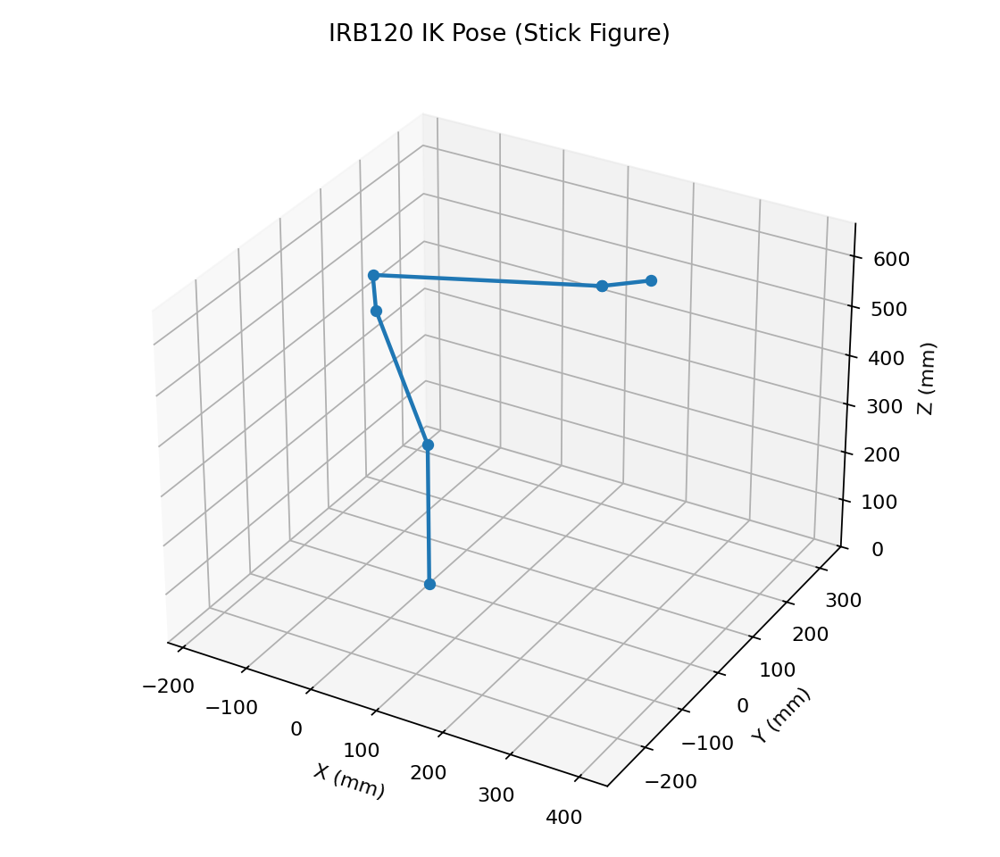

# industrial_robot_core


Industrial robot kinematics core library (C++17 + pybind11) for 6-DoF manipulators: forward kinematics (FK), Jacobian, and damped least-squares inverse kinematics (DLS IK). Includes C++ tests/benchmark and a Python demo that renders a pose image.

## Requirements

- C++17 compiler (GCC/Clang)
- CMake >= 3.16
- Eigen3
- Python 3 (required for Python bindings/demo)
- matplotlib (required for `examples/demo.py`)

Ubuntu example:

```bash
sudo apt-get update
sudo apt-get install -y cmake g++ libeigen3-dev python3 python3-pip
python3 -m pip install --user matplotlib
```

macOS example (Homebrew):

```bash
brew install cmake eigen python
python3 -m pip install --user matplotlib
```

## Quick start (Linux/macOS)

From clone to generating `examples/robot_pose.png`:

```bash
git clone https://github.com/chung-manhin/industrial_robot_core.git
cd industrial_robot_core_clean

./tools/ci_smoke.sh
```

Preview:



## Run tests

```bash
ctest --test-dir build --output-on-failure
```

## Benchmark

```bash
./build/benchmark_ik
```

Example output (machine-dependent):

```text
IK Benchmark (10000 trials)
Seed mode: multi-seed
Avg (us): 1.602
P99 (us): 2.375
Max (us): 27.308
Success rate: 100.000%
```

### Single vs multi seed (example)

The absolute numbers depend on CPU, compiler, and build flags. The comparison below is from one run on the developer machine:

| Mode | Success rate | Avg (us) | P99 (us) | Max (us) |
|------|--------------|----------|----------|----------|
| `--single-seed` | 72.390% | 150.175 | 468.978 | 1042.230 |
| `--multi-seed` (default) | 100.000% | 1.602 | 2.375 | 27.308 |

## Python demo

```bash
PYTHONPATH=build python3 examples/demo.py
```

Output:

- `examples/robot_pose.png`

## CI

GitHub Actions runs a matrix on **ubuntu-latest** and **macos-latest** with Python **3.10/3.11/3.12/3.13**. Each job executes the same smoke script:

- CMake configure/build (Release)
- `ctest --output-on-failure`
- run `benchmark_ik` (logs saved)
- run Python demo to generate `examples/robot_pose.png` and verify it is non-empty
- upload artifacts: `robot_pose.png` + benchmark/demo logs

## Units / Conventions

- The demo DH parameters in `examples/demo.py` are in **millimeters (mm)**.
- `TaskSpaceWeights.pos_unit` scales translation units (e.g., `0.001` for mm -> m) so translation and rotation errors are comparable.

## FAQ

**Q: `examples/demo.py` fails with `ImportError: matplotlib`**

A: Install matplotlib:

```bash
python3 -m pip install --user matplotlib
```

**Q: Where does the Python module come from?**

A: The build produces a pybind11 module named `industrial_robot_core` into the build directory; run the demo with `PYTHONPATH=build`.
